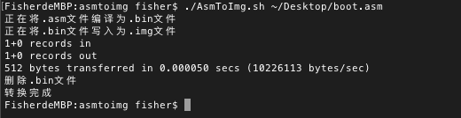

# ASMTOIMG

## 介绍

ASM汇编源文件编译写成镜像之后需要2步操作。为了方便，直接从源文件到镜像文件，我写了这个脚本，脚本将二进制文件写入到镜像文件后会将二进制文件移除

## 使用方法

```sh
./AsmToImg.sh [-h] source.asm
```

| 参数 |   说明   |
| :--: | :------: |
|  h   | 帮助说明 |

脚本会将`img`文件输出到与`source.asm`同一级目录中，运行的截图如下：

